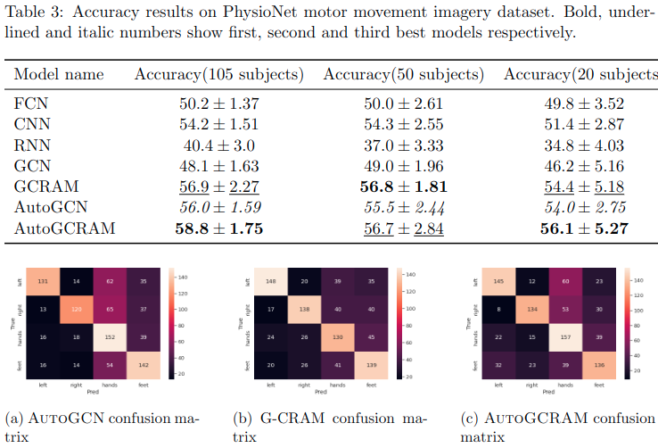
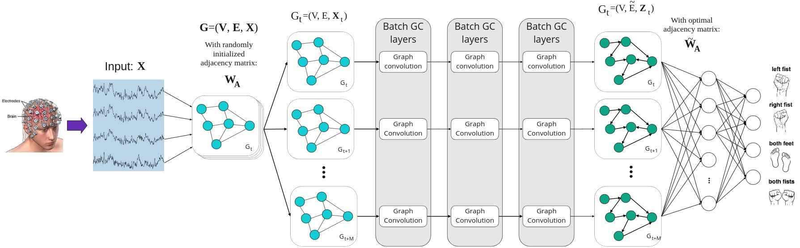
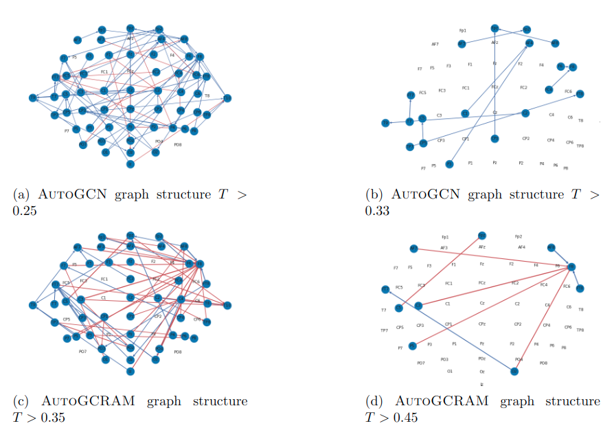

<!-- PROJECT SHIELDS -->
<!--
*** I'm using markdown "reference style" links for readability.
*** Reference links are enclosed in brackets [ ] instead of parentheses ( ).
*** See the bottom of this document for the declaration of the reference variables
*** for contributors-url, forks-url, etc. This is an optional, concise syntax you may use.
*** https://www.markdownguide.org/basic-syntax/#reference-style-links
-->
[](https://opensource.org/licenses/MIT)

<!-- ABOUT THE PROJECT -->
## About
This repository contains source code for my graduate studies final thesis.   
This work proposes Graph Convolution Networks for EEG dataset with trainable adjacency matrices called AutoGCN. This work also includes a modified GCRAM (Dalin Zhang et al. 2020. doi: 10.1109/JBHI.2020.2967128) with trainable adjacency matrices called AutoGCRAM.

## Quick start

1. Clone this repository
```bash
git clone https://github.com/amar-enkhbat/AutoGCN.git
```

2. Download Physionet EEG MMI dataset
```bash
cd AutoGCN
mkdir dataset
cd dataset
wget -r -N -c -np https://physionet.org/files/eegmmidb/1.0.0/
```
or download using one of the methods mentioned in the Physionet EEG MMI dataset homepage: https://physionet.org/content/eegmmidb/1.0.0/


2. Install prerequisites
```bash
pip install -r requirements.txt
```

3. Preprocess dataset
```bash
python generate_train_test_data.py
```

4. Run the ```main.py``` file
```bash
python main.py
```

5. To run on the 20, 50, 105 subject dataset just comment out the rest on lines 172-175:
```Python
    # Datasets to train
    n_subjects = 20
    # n_subjects = 50
    # n_subjects = 105
```

## Results
Results should look something like this after training is finished:
```
model_name	        accuracy	        precision_macro	    precision_weighted
imagine_cnn	        0.541594827586207	0.560832621246787	0.562545876076649
imagine_fcn	        0.502370689655172	0.503570835192508	0.504417588332353
imagine_gcn	        0.481465517241379	0.484078408983918	0.485347238589249
imagine_gcn_auto	0.559913793103448	0.580180127659347	0.581644804542687
imagine_gcram	    0.568965517241379	0.578866675215733	0.580696547988416
imagine_gcram_auto	0.588146551724138	0.595116225905544	0.596364961836841
imagine_rnn	        0.404094827586207	0.406927637108595	0.407997732444192
```

### Results from paper:


Results are in directories:
output/output_105_subjects_final
output/output_50_subjects_final
output/output_20_subjects_final
## About this work

### Abstract
Brain-computer interface or BCI is a direct communication pathway between the brain’s electrical activity and and external electronic devices such as computers or robotic wheelchair or limbs. Creating a BCI that can accurately classify motor movement imagery has numerous potential applications such as: creating interface between computers and humans with partial or full motor disability, supporting motor rehabilitation of post-stroke patients, video game controller and various otherneural interface devices. This is usually accomplished by 1) acquiring brain signals, 2) Extracting features, 3) Decoding features and 4) Outputting commands.

There are 2 widely used paradigms for BCI. First paradigm is traditional BCI methods where brain signals are preprocessed using signal processing methods such as Fourier transforms, band-pass filters, spatial filters to extract frequency domain, band power and common spatial pattern (CSP) features. Then extracted features are decoded using classifiers such as LDA, SVM, Gaussian classifier. Second paradigm is end-to-end Deep Learning (DL) where brain signals are handled as time-series data and decoded using Deep Neural Networks (DNN) with complex architecture and large number of trainable parameters. Even though both are widely studied, neither paradigm consider the inherent interconnected graph-like structure of the human brain.
    
In this work we propose a graph neural networks model called AutoGCN which can simultaneously learn graph structure of EEG nodes and classify motor movement imagery. AutoGCN accomplishes this by:
1. Using trainable adjacency matrices to represent structure
2. Calculating graph encodings using stacked Batch Graph Convolution layers.

Batch Graph Convolution layer is a modified version of Graph Convolution layer originally proposed by Kipf et al. in 2016. Key difference between a BatchGraphConv layer and the original GraphConv layer is that BatchGraphConv can handle multiple, or batch of graphs as opposed to GraphConv which can handle only a single graph. 

Finally, experiments conducted in Physionet Motor Movement Imagery dataset show that AutoGCN can learn more optimal adjacency matrix than previous works’ manually defined adjacency matrices. Also, we show that previous work augmented by our method achieves state-of-the-art results in motor movement imagery tasks.

### Model architecture


### Learned Effective Conectivities (EC) from PhysioNet EEG MMI dataset


### Future work
1. Adjacency matrix for each label instead of single matrix for whole dataset
2. More complex model (complex graph convolution, complex message passing etc)
3. Train on complex tasks such as Emotion data which requires larger area of the brain
4. Train on other types of datasets images, tabular data etc with known graph structure
5. Comparison of baseline graph strucutre with learned graph structure.

